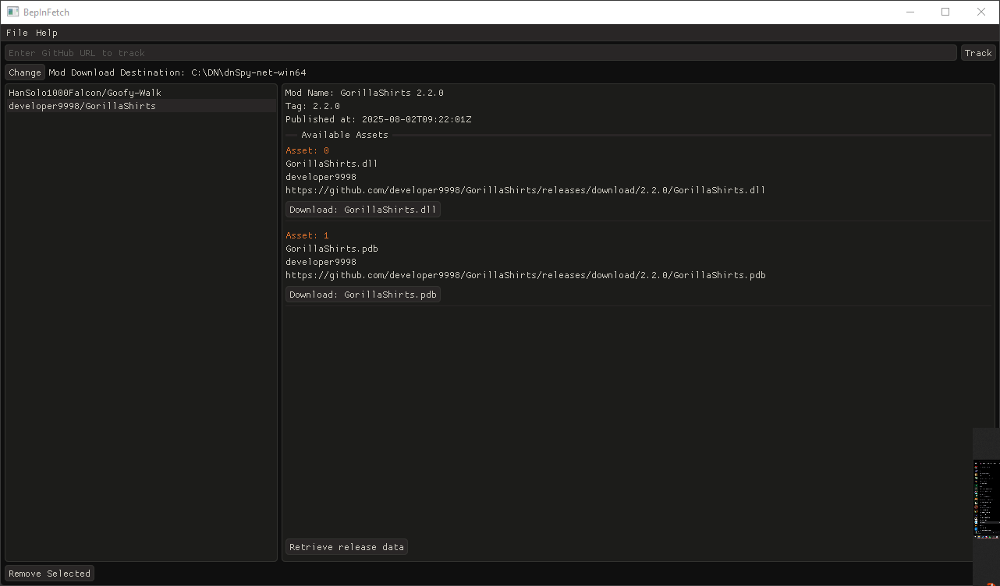

BepInFetch 

[](./LICENSE)

A C++ 20 application for managing BepInEx mods for Unity games

## Table of Contents

- [About](#about)
- [Features](#features)
- [Installation](#installation)
- [Building](#building)
- [Usage](#usage)
- [Screenshots](#screenshots)
- [Contributing](#contributing)
- [Planned Features](#planned-features)
- [License](#license)

## About

BepInFetch is a C++ 20 application designed for managing BepInEx mods, originally created for the Gorilla Tag community
as an alternative to the community's MMM mod manager.

BepInFetch uses [GLFW](https://www.glfw.org/) for window management and OpenGL 4.4 for rendering. Its graphical user interface
is built with [Dear ImGui](https://github.com/ocornut/imgui). For networking BepInFetch makes use of [cpp-httplib](https://github.com/yhirose/cpp-httplib)
with SSL support from [OpenSSL](https://slproweb.com/products/Win32OpenSSL.html) to request data and download content from
the internet. [nlohmann::json](https://github.com/nlohmann/json) is used for parsing JSON.

## Installation

To get a working binary, simply download the latest release executable from the release page.
The application creates two JSON files upon closing, one for app settings, and another for mod data.
It may be desirable to create a dedicated directory for the app tp contain all required files.

## Building

> [!WARNING]
>
> **Platform support notice:** Currently, BepInFetch only supports 64-bit Microsoft Windows systems.
Building and running on Unix-like platforms such as Linux or MacOS is not supported due to platform specific dependencies such as OpenGL 4.4
& OpenSSL for Windows 64-bit.

### Prerequisites
- Windows 64-bit 10 or later
- Clang/LLVM installed and added to your PATH
- Ninja build system installed and added to your PATH
- CMake (version 3.26 or newer)
- OpenSSL (install via vcpkg: `openssl:x64-windows-static`)

**Step 1** Install OpenSSL

Use vcpkg to install the 64-bit static OpenSSL version

```
$ vcpkg install openssl:x64-windows-static
```

**Step 2** Clone the repository

Clone the repository along with all submodules (e.g., [Dear ImGui](https://github.com/ocornut/imgui) & [imgui-filebrowser](https://github.com/AirGuanZ/imgui-filebrowser))

```
  $ git clone --recursive https://github.com/JJoeDev/BepInFetch.git
```

**Step 3** Build BepInFetch

There are two approaches to building the project:

- Using CMake directly with an auto-detected compiler:
```
  $ cmake -DCMAKE_TOOLCHAIN_FILE=C:/vcpkg/scripts/buildsystems/vcpkg.cmake -DVCPKG_TARGET_TRIPLET=x64-windows-static -DOPENSSL_ROOT_DIR=C:/vcpkg/installed/x64-windows-static .
  $ cmake --build .
```
- Using the provided `build.bat` script (requires Ninja)
```
  $ .\build.bat
```

It is recommended to use Ninja with Clang for faster, more efficient builds on Windows. (and possibly because we dislike MSVC)

After a successful build, a new directory named `bin` will appear at the root of the repository. Inside it, you will
find the BepInFetch.exe executable.

**Contributing**
If you wish to contribute to BepInFetch, either by reporting bugs, or adding features, please read the [Contributing](#contributing)
section.

## Usage
Using BepInFetch is supposed to be simple. Once the app is open you should see a menu bar at the top of the window, and
a search bar right under the menu bar. This search bar is where you tell BepInFetch what mods it should keep track of.

By default BepInFetch has no idea where you wish to download mods to, so the default destination will be the location
where you are running BepInFetch from. It is recommended to change the default path to the destination of the game with
BepInEx installed.

Adding a mod to keep track of is quite easy, first you need to find a mod. For this example I will be using
`https://github.com/HanSolo1000Falcon/Goofy-Walk`. In the search bar you simply give it the Username/Repository,
so in this example case I would input `HanSolo1000Falcon/Goofy-Walk` and press enter, or the "track" button. 

Now there should be an entry by the same name as you put in the search bar on the left pane in the center of the window.
This pane shows you all the mods BepInFetch is currently tracking. You can select a mod from the left pane too see mod
information in the right pane. If the right pane shows empty data like "Mod Name: " it simply means BepInFetch hasn't
downloaded any information about this mod yet. To solve this press the "Retrieve release data" button at the bottom of
the right pane.

Once the release data has been downloaded, you should be able to see the available assets. In this example BepInFetch
should show "Asset: 0" with the first string being "GoofyWalk.dll", This is the mod I wish to download in this example,
so I can press the "Download: GoofyWalk.dll" button located at the bottom of the release.

Now you should be able to find the downloaded file at the location specified and show right under the search bar at the
top of the application.

## Screenshots


## Contributing

Thank you for your interest in contributing to BepInFetch!

* [How to contribute](#how-to-contribute)
* [Guidelines](#guidelines)

### How to contribute

1. **Report Issues:**

If you encounter bugs, have feature requests, or ideas for improvement, please create an issue on the GitHub repository.
Provide clear and detailed information to help reproduce and understand problems.

2. **Fork and Clone:**

Fork the repository and clone it to your local machine for development.

3. **Create a Branch:**

Make your changes in a separate feature branch named descriptively, e.g. `feature/add-animations` or `bugfix/fix-crash-on-startup`.

4. **Coding style:**

Follow the existing C++ coding style and conventions.
Write clear, and maintainable code, with comments where appropriate.

```cpp
/// CODING STYLE

// Indentation is 4 spaces
// Classes and functions has their starting curley brace on the same line
// Classes use PascalCase. 
class SomeClass {
public:
    SomeClass();

    void SomeClassFunc();

private:
    // Class member variables has the m_ prefix
    // They also use camelCase
    int m_someInt{};
};

// Variables in functions does not have any prefix
// But they are still camelCase
int randomInteger{};

// More syntax conventions may be added in the future
```

5. **Submit a Pull Request (PR):**

Open a PR from your feature branch to the main branch of the repository. Include a clear description of the changes
and why they are necessary.

6. **Code Review:**

Pull requests will be reviewed by maintainers. Be responsive to feedback and ready to make changes.

### Guidelines

* Keep commits focused and atomic
* Write descriptive commit messages
* Avoid committing generated files or build artifacts (example: .pdb .dll .sln)
* If there are generated files add them to `.ignore` and `.gitignore`

## Planned Features

* Update detection (Be able to detect if the current version is older than the latest)

## License

This project is licensed under the [MIT License](./LICENSE)
